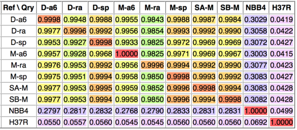

## Comparative Genomics Workflows (Mock Narrative Method)

The goal of the comparative genomics service is to compare multiple
genomes on several levels: DNA sequence, whole genome alignment,
proteome, variations (SNPs and indels).

The service will enable users to identify the genomic differences
between species or closely related strains. These differences will be
stored in a computable form so that machine learning methods can
eventually connect them to phenotypic differences and uncover the
genomic basis for them.

### Method 1: Genome Sequence Comparison

#### Input 

Select a set of genomes to be compared.

#### Computation

The service will run all-to-all DNAdiff comparisons for the genome pairs. 

#### Output

The output consists of a downloadable report file and a visual
sequence-level similarity matrix.

### Method 2: Whole Genome Alignment

#### Input 

Select a list of genomes to be compared.

#### Algorithm

Select a whole genome alignment tool: Mugsy or Mauve.

#### Computation

The service will run whole genome alignment on the pairs of genomes. 

#### Output

The output consists of a multiple alignment object and a visual
circular view of the genome rearrangements and inversions. 

### Future methods 

- Proteome Comparison v2

- Pangenome Analysis v2

- Variation Analysis

